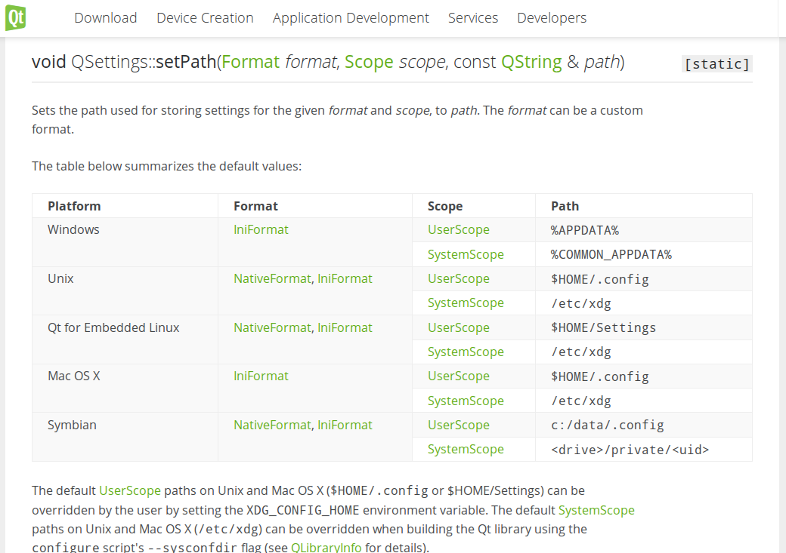
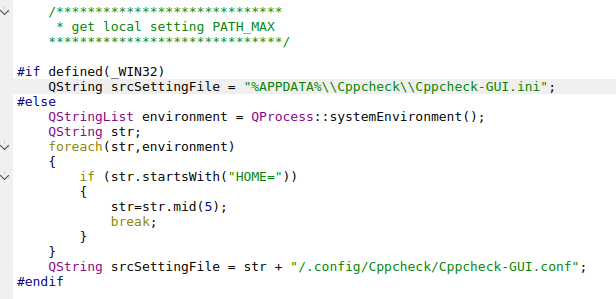
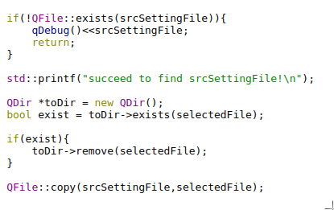
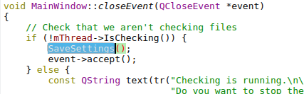

# GUI偏好设置导出功能的实现
---
## 偏好导出
## By Moonfoam on 2016-4-1 11:48 CST
---
## 开发前的规划(偏好导出)
### 关于导出，开发前我有两个选择方向，各有优缺点：
1. 使用Shell脚本进行复制关键文件达到导出偏好的目的
	- 优点：简单方便
	- 缺点：步骤相对麻烦，与图形化界面整合度低，同时由于多平台脚本（bat，sh）不同，需要做多份脚本，也要求用户会辨识相应脚本
2. 使用GUI图形化界面进行纯图形界面操作
	- 优点：操作简单方面，用户友好，多平台统一，与图形界面之间的耦合度高，偏好即改即用
	- 缺点：制作相对复杂

> 经过谨慎考虑，我选择了第二种方案，让项目看起来更加统一化。
	对于实现GUI导出功能，我需要实现的有：
	1. 了解各个QT函数作用
	2. 制作或找到文件保存接口
	3. 找到存储偏好设置的变量
	4. 制作GUI窗口接口
	5. 制作或找到设置保存的函数(在导出前使用达到即时设置即时导出的目的)

- 进行规划设计：
    - 由于每次打开后GUI设置都会自动存储，因此本地一定存在一个设置文件，经过搜索，发现在我的系统下~/.config/CppCheck/目录下存在系统自动导出的文件
	因此，我在思考能不能继承一个导出函数然后重写其保存路径来达到导出设置到指定目录的目的！
	- 由此我锁定到了Main.cpp下的设置变量：
QSettings* settings = new QSettings("Cppcheck", "Cppcheck-GUI", &app);
	- 经过官方文档查询，不幸发现这是QT预置的保存方法，它会保存到系统指定路径，因此无法对路径进行重写。
    - 仔细查看了各个保存的过程发现：
        1. 设置变量存在于：QSettings* settings中
        2. 使用mSettings->setValue（）进行设置写入
        3. 使用mSettings->value（）进行设置值获取
    - 由此我想是否需要一条条进行写入文本和读出，后考虑到过于复杂，并且多平台间易出错，寻找其他方式。
    - 这时，我想起既然QT封装了一个设置保存机制，那它的路径应该不会太多，果然，在其函数界面看到下图：
    - 
    - 由此可见，其对Mac，Linux和Windows的路径是确定的，由此我只要在确定的设置下做一个简单的复制即可实现功能了，首先确定源文件路径，
        - Windows：%APPDATA%\\Cppcheck\\Cppcheck-GUI.ini
        - Linux&Mac:$HOME/.config/Cppcheck/Cppcheck-GUI.conf
- 开发过程
    - 使用#if#endif获取系统存储路径，发现Linux下QT路径无法使用$HOME获取环境变量，使用Qprocess获取系统环境变量以达到获取路径的目的
    - 
    - 进行必要的文件存在性检测后使用QFile进行文件间的复制
    - 
    - 进行导出检测，成功，但是发现无法做到实时导出，猜测是临时设置不会实时保存到设置保存文件导致复制的是老的设置。
    - 经实验，发现当软件关闭时设置才会更新，于是去closeEvent函数查看，发现SaveSettings函数
    - 
    - 加到导出函数第一句进行强制设置保存，发现能完美实现实时导出设置功能
- 开发中遇到的问题
    1. 所需函数的锁定
    2. Linux无法直接获取环境变量$HOME
    3. 实时导出的实现
